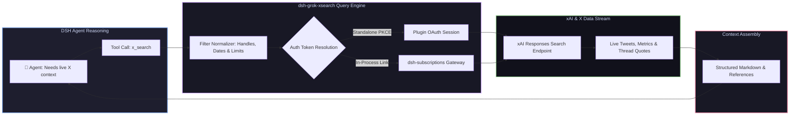

# 📦 @goodandready/dsh-grok-xsearch

<div align="center">

<h3>Real-Time X (Twitter) Search Tool Powered by SuperGrok OAuth for DeepSeek Harness</h3>

<p align="center">
  <a href="https://www.npmjs.com/package/@goodandready/dsh-grok-xsearch"></a>
  <a href="LICENSE"></a>
  <a href="https://github.com/topics/dsh-plugin"></a>
  <a href="https://nodejs.org"></a>
</p>

<p align="center">
  <a href="https://goodandready.app/"></a>
</p>

<p align="center">
  <a href="README.md"><b>🇬🇧 English</b></a> •
  <a href="README.ru.md"><b>🇷🇺 Русский</b></a> •
  <a href="README.zh.md"><b>🇨🇳 中文说明</b></a>
</p>

</div>

---

## ⚡ Overview

**`dsh-grok-xsearch`** equips your **DeepSeek Harness** agents with real-time X (Twitter) intelligence via a dedicated `x_search` tool. 

By leveraging authenticated SuperGrok OAuth sessions, agents can query live breaking news, developer sentiment, community threads, author timelines, and discussions across specific date ranges without expensive per-query X API tiers.



---

## 🔍 `x_search` Tool Reference

The plugin registers `x_search` directly in `ctx.tools`, allowing agents to query the real-time social web:

### Tool Parameters

| Parameter | Type | Required | Description |
|---|---|---|---|
| `query` | `string` | **Yes** | Search keywords, topics, or hashtags |
| `authors` | `string[]` | No | Target specific accounts (up to 10 `@handle` usernames) |
| `exclude_authors` | `string[]` | No | Exclude specific accounts from results (up to 10 handles) |
| `from_date` | `string` | No | Start date filter (`YYYY-MM-DD`) |
| `to_date` | `string` | No | End date filter (`YYYY-MM-DD`) |
| `max_results` | `number` | No | Maximum number of posts to retrieve (default `10`) |

### Example Agent Queries
> "Search X for discussions about the latest PyTorch release by @PyTorch or @ylecun from 2026-08-01"
> "Find recent breaking reports on semiconductor announcements with query 'quantum chip' excluding @spam_bot"

---

## 🔑 Authentication Options

1. **Standalone SuperGrok OAuth Login**: Connect directly via the built-in PKCE login flow in **Settings → X Search**.
2. **Ecosystem Interoperability**: If [`dsh-subscriptions`](https://github.com/GooDAnDReaDY/dsh-subscriptions) is already authenticated with a Grok account, `dsh-grok-xsearch` automatically borrows the active session without requiring a separate login.

---

## 📦 Quick Installation

```bash
dsh plugin --profile web add @goodandready/dsh-grok-xsearch
```

> [!IMPORTANT]
> Restart DSH Web UI after installation (`systemctl --user restart dsh-web`) and authenticate your SuperGrok session in Settings.

---

## 🔌 HTTP API Routes

| Route | Method | Description |
|---|---|---|
| `/dsh-grok-xsearch/config` | `GET, POST` | Inspects or modifies search parameters and default limits |
| `/dsh-grok-xsearch/oauth/start` | `POST` | Initiates standalone SuperGrok OAuth PKCE flow |
| `/dsh-grok-xsearch/oauth/callback` | `GET` | Handles OAuth redirect callback and securely persists tokens |
| `/dsh-grok-xsearch/oauth/complete` | `POST` | Finalizes authentication handshake |
| `/dsh-grok-xsearch/logout` | `POST` | Disconnects and clears local session tokens |

---

## 📄 License

MIT © [GooDAnDReaDY](https://github.com/GooDAnDReaDY)
