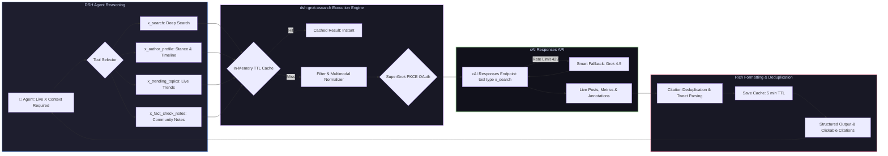

# 📦 @goodandready/dsh-grok-xsearch

<div align="center">

<h3>Real-Time X (Twitter) Intelligence & Search Tool Suite Powered by SuperGrok OAuth for DeepSeek Harness</h3>

<p align="center">
  <a href="https://www.npmjs.com/package/@goodandready/dsh-grok-xsearch"></a>
  <a href="LICENSE"></a>
  <a href="https://github.com/topics/dsh-plugin"></a>
  <a href="https://nodejs.org"></a>
</p>

<p align="center">
  <a href="https://goodandready.app/"></a>
</p>

<p align="center">
  <a href="README.md"><b>🇬🇧 English</b></a> •
  <a href="README.ru.md"><b>🇷🇺 Русский</b></a> •
  <a href="README.zh.md"><b>🇨🇳 中文说明</b></a>
</p>

</div>

---

## ⚡ Overview

**`dsh-grok-xsearch`** equips your **DeepSeek Harness** agents with real-time X (Twitter) intelligence and a suite of dedicated analytical tools. 

By leveraging authenticated SuperGrok OAuth sessions with the xAI Responses API (`POST /responses`), agents can query live breaking news, developer sentiment, community threads, author timelines, viral trends, and Community Notes fact-checking without expensive per-query X API tiers.



---

## 🛠️ Complete Tool Suite Reference

The plugin registers four purpose-built tools in `ctx.tools`:

### 1. `x_search` — Deep Post & Thread Search

General-purpose natural language search across X posts, threads, media, and engagement metrics.

| Parameter | Type | Required | Description |
|---|---|---|---|
| `query` | `string` | **Yes** | Natural language search query or topic keywords |
| `allowed_x_handles` | `string` | No | Comma-separated `@handles` to include (up to 10) |
| `excluded_x_handles` | `string` | No | Comma-separated `@handles` to exclude (up to 10) |
| `from_date` | `string` | No | Start date filter (`YYYY-MM-DD`) |
| `to_date` | `string` | No | End date filter (`YYYY-MM-DD`) |
| `only_original_posts` | `boolean` | No | Omit retweets and quote echoes |
| `has_media` | `boolean` | No | Filter for posts containing images, infographics, or videos |
| `has_links` | `boolean` | No | Filter for posts containing external links, papers, or repositories |
| `only_threads` | `boolean` | No | Filter for extended multi-tweet discussion threads |
| `lang` | `string` | No | Language code filter (e.g. `en`, `ru`, `ja`) |
| `min_likes` | `number` | No | Minimum likes threshold for quality filtering |
| `min_reposts` | `number` | No | Minimum reposts/retweets threshold |
| `enable_image_understanding` | `boolean` | No | Let xAI inspect and extract data from images and charts |
| `enable_video_understanding` | `boolean` | No | Let xAI analyze video clips and speech |

---

### 2. `x_author_profile` — Author Timeline & Position Analysis

Inspects an expert or developer's recent discussions, technical stances, and shared insights on X.

| Parameter | Type | Required | Description |
|---|---|---|---|
| `handle` | `string` | **Yes** | Author's username (e.g., `@ylecun` or `sama`) |
| `focus_topic` | `string` | No | Specific topic or thesis to analyze the author's stance on |
| `from_date` | `string` | No | Start date filter (`YYYY-MM-DD`) |
| `to_date` | `string` | No | End date filter (`YYYY-MM-DD`) |
| `only_original_posts` | `boolean` | No | Focus on original author posts (default `true`) |

---

### 3. `x_trending_topics` — Real-Time Trend Discovery

Uncovers emerging topics, breaking announcements, viral threads, and community discussions.

| Parameter | Type | Required | Description |
|---|---|---|---|
| `domain` | `string` | No | Topic domain (`tech`, `ai`, `crypto`, `science`, `world`, `general`, default: `tech`) |
| `region` | `string` | No | Geographic or community focus (`Global`, `US`, `EU`, `Asia`) |
| `timeframe` | `string` | No | Period (`today`, `past_24h`, `past_week`, default: `today`) |
| `min_likes` | `number` | No | Minimum likes threshold for viral post detection |

---

### 4. `x_fact_check_notes` — Community Notes & Fact-Checking

Investigates claims, viral rumors, or news stories for Community Notes, expert rebuttals, and corrections on X.

| Parameter | Type | Required | Description |
|---|---|---|---|
| `claim` | `string` | **Yes** | Statement or rumor to fact-check |
| `target_url` | `string` | No | Specific X post or article URL to verify |
| `allowed_x_handles` | `string` | No | Comma-separated researcher or institutional handles to check |
| `enable_image_understanding` | `boolean` | No | Inspect attached images or infographics in debunking posts |

---

## 🛡️ Resilience & Performance Features

* **Smart Model Fallback (429 Rate Limit)**: When `grok-4.6` encounters temporary upstream rate limits (HTTP 429), the execution engine automatically falls back to `grok-4.5` or `grok-4-fast-reasoning`, ensuring uninterrupted agent workflow.
* **In-Memory TTL Caching**: Identical queries within a 5-minute window are served instantly from the local cache, conserving xAI API quotas.
* **Citation Deduplication & Parsing**: Citations are parsed into structured references with author handles (`@handle`), status IDs, and clickable URLs.
* **Full Multi-Language UI**: Settings card supports English, Russian, and Chinese localization via `ctx.locale.register`.

---

## ⚙️ Configuration (`settings.yaml` / Web UI)

```yaml
dsh-grok-xsearch:
  enabled: true
  grokClientId: "<YOUR_GROK_OAUTH_CLIENT_ID>"
  model: "grok-4.6"
  timeoutSeconds: 180
  retries: 2
  autoFallbackModel: true
  enableCache: true
  cacheTtlSeconds: 300
```

| Parameter | Type | Default | Description |
|---|---|---|---|
| `enabled` | `boolean` | `true` | Enables or disables all Grok X tools |
| `grokClientId` | `string` | `""` | OAuth Client ID for SuperGrok authentication |
| `model` | `string` | `"grok-4.6"` | Default Grok model for Responses queries |
| `timeoutSeconds` | `number` | `180` | Request timeout before cancellation |
| `retries` | `number` | `2` | Number of retry attempts on transient 5xx errors |
| `autoFallbackModel` | `boolean` | `true` | Automatically try Grok 4.5 upon HTTP 429 rate limit |
| `enableCache` | `boolean` | `true` | In-memory cache for recent search queries |
| `cacheTtlSeconds` | `number` | `300` | Cache retention time in seconds |

## Compatibility & Stability

- **Version 0.3.9 (Robustness & Resilience Hardening)**:
  - **Token Request Socket Timeout**: `formTokenRequest` in `lib/wire.js` now enforces a strict 15-second `AbortSignal.timeout` preventing hanging sockets during token exchanges or refresh attempts.
  - **Auto-Eviction of Invalid Credentials**: When upstream refresh returns fatal `invalid_grant` or HTTP 400, stored invalid credentials blob is automatically purged from DSH credentials store to prevent infinite retry storms.
  - **OAuth Error Handling in Callback**: Handles `?error=` and `?error_description=` query parameters from xAI OAuth provider (e.g. user denied permissions) cleanly, displaying actionable instructions instead of cryptic "Missing code" errors.
  - **Proactive Cache Pruning & Capacity Limits**: `SEARCH_CACHE` (search queries) and `MODELS_CACHE` (xAI model catalog) proactively prune expired entries upon insertion and enforce upper capacity bounds to prevent memory bloat.
  - **UI Cache Management**: The settings card now displays live in-memory cache usage and provides an interactive "Clear cache" button calling `/dsh-grok-xsearch/cache/clear`.
  - **Formal Design Contract**: Added comprehensive `docs/design/DESIGN.md` specifying all agent tools, UI card states, foundations, user flows, and locked design decisions.

- **Version 0.3.8 (Architecture & Stability Hardening)**:
  - **Single-Flight OAuth Mutex**: Prevents concurrent request token refresh races by consolidating simultaneous refresh triggers into a single upstream request.
  - **Auto-Recovery on HTTP 401 Unauthorized**: If an access token expires mid-operation, tools automatically perform an explicit token refresh and retry the search query transparently.
  - **Network & Transient Error Backoff**: Added exponential backoff retry logic for upstream network and 5xx transient failures.
  - **In-Memory Catalog Caching**: Cached xAI model catalog lookups (`listModelsForSettings`, 15-minute TTL) eliminate UI setting panel loading stalls.
  - **Citation Canonicalization & Tracking Stripping**: Automatically removes URL tracking parameters (`?s=`, `?t=`, `ref_src`, `utm_*`) and harmonizes `twitter.com` into canonical `https://x.com/<handle>/status/<id>` citations to eliminate duplicate citations.
  - **Streamlined OAuth Pending Store**: Replaced multi-file disk pending store with a lightweight in-memory Map with automatic TTL expiration.
  - **Settings Scope Race Elimination**: Removed dual-write race in client settings UI to use single authoritative HTTP config persistence.

- **Version 0.3.3**: Hardens compatibility with mixed DeepSeek Harness alpha/rc peer resolutions. All four registered tools expose an object-root JSON Schema (`type: "object"` with `properties` and `required`) even when an older `dsh-tools` runtime returns the legacy property-map form. Tool behavior and OAuth/API contracts are unchanged.

## 📦 Quick Installation

```bash
dsh plugin --profile web add @goodandready/dsh-grok-xsearch
```

> [!IMPORTANT]
> Authenticate your SuperGrok session in **Settings → Plugins → Grok X Search & Intelligence Suite**.

---

## 🔌 HTTP API Routes

| Route | Method | Description |
|---|---|---|
| `/dsh-grok-xsearch/config` | `GET, PUT` | Inspects or updates search configuration and model selection |
| `/dsh-grok-xsearch/cache/clear` | `POST` | Clears in-memory query cache |
| `/dsh-grok-xsearch/oauth/start` | `GET` | Initiates standalone SuperGrok OAuth PKCE flow |
| `/dsh-grok-xsearch/oauth/callback` | `GET` | Handles browser OAuth redirect callback |
| `/dsh-grok-xsearch/oauth/complete` | `POST` | Finalizes authentication from manual URL paste |
| `/dsh-grok-xsearch/logout` | `POST` | Clears stored session tokens |

---

## 📄 License

MIT © [GooDAnDReaDY](https://github.com/GooDAnDReaDY)
