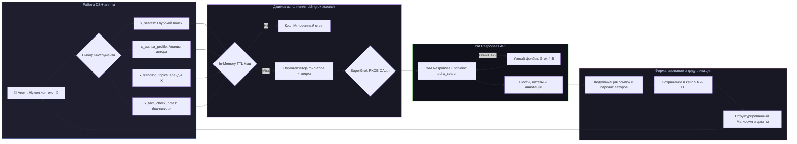

# 📦 @goodandready/dsh-grok-xsearch

<div align="center">

<h3>Интеллектуальный комплекс поиска и анализа X (Twitter) на базе SuperGrok OAuth для DeepSeek Harness</h3>

<p align="center">
  <a href="https://www.npmjs.com/package/@goodandready/dsh-grok-xsearch"></a>
  <a href="LICENSE"></a>
  <a href="https://github.com/topics/dsh-plugin"></a>
  <a href="https://nodejs.org"></a>
</p>

<p align="center">
  <a href="https://goodandready.app/"></a>
</p>

<p align="center">
  <a href="README.md"><b>🇬🇧 English</b></a> •
  <a href="README.ru.md"><b>🇷🇺 Русский</b></a> •
  <a href="README.zh.md"><b>🇨🇳 中文说明</b></a>
</p>

</div>

---

## ⚡ Обзор возможностей

**`dsh-grok-xsearch`** предоставляет агентам **DeepSeek Harness** набор специализированных аналитических инструментов для работы с социальной сетью **X (Twitter)** в реальном времени.

Используя сессию авторизации SuperGrok OAuth через официальный xAI Responses API (`POST /responses`), плагин позволяет анализировать свежие новости, мнения разработчиков, экспертные треды, профили авторов, вирусные тренды и заметки фактчекинга Community Notes без дорогостоящих платных тарифов X API.



---

## 🛠️ Справочник инструментов

Плагин регистрирует 4 специализированных инструмента в реестре `ctx.tools`:

### 1. `x_search` — Глубокий поиск постов и тредов

Универсальный поиск постов, медиа, обсуждений и метрик на естественном языке с расширенными фильтрами.

| Параметр | Тип | Обязательный | Описание |
|---|---|---|---|
| `query` | `string` | **Да** | Поисковый запрос на естественном языке |
| `allowed_x_handles` | `string` | Нет | Включаемые имена авторов через запятую (`@handle`, до 10) |
| `excluded_x_handles` | `string` | Нет | Исключаемые имена авторов через запятую (до 10) |
| `from_date` | `string` | Нет | Начальная дата диапазона (`YYYY-MM-DD`) |
| `to_date` | `string` | Нет | Конечная дата диапазона (`YYYY-MM-DD`) |
| `only_original_posts` | `boolean` | Нет | Исключать репосты и повторы цитат |
| `has_media` | `boolean` | Нет | Искать только посты с фото, графиками или видео |
| `has_links` | `boolean` | Нет | Искать только посты со ссылками на статьи или репозитории |
| `only_threads` | `boolean` | Нет | Искать развернутые авторские треды |
| `lang` | `string` | Нет | Код языка (например, `ru`, `en`, `ja`) |
| `min_likes` | `number` | Нет | Минимальный порог лайков |
| `min_reposts` | `number` | Нет | Минимальный порог репостов/ретвитов |
| `enable_image_understanding` | `boolean` | Нет | Анализ и извлечение данных из графиков/скриншотов |
| `enable_video_understanding` | `boolean` | Нет | Анализ видеофрагментов и речи в постах |

---

### 2. `x_author_profile` — Анализ профиля и тезисов автора

Изучение активности, ключевых тезисов, сферы экспертизы и позиции конкретного автора.

| Параметр | Тип | Обязательный | Описание |
|---|---|---|---|
| `handle` | `string` | **Да** | Имя пользователя в X (например, `@ylecun` или `sama`) |
| `focus_topic` | `string` | Нет | Конкретная тема или вопрос для анализа позиции автора |
| `from_date` | `string` | Нет | Начальная дата диапазона (`YYYY-MM-DD`) |
| `to_date` | `string` | Нет | Конечная дата диапазона (`YYYY-MM-DD`) |
| `only_original_posts` | `boolean` | Нет | Только оригинальные посты автора (по умолчанию `true`) |

---

### 3. `x_trending_topics` — Поиск горячих трендов в реальном времени

Выявление актуальных дискуссий, вирусных тем и инцидентов в заданном домене.

| Параметр | Тип | Обязательный | Описание |
|---|---|---|---|
| `domain` | `string` | Нет | Домен темы (`tech`, `ai`, `crypto`, `science`, `world`, `general`, по умолчанию `tech`) |
| `region` | `string` | Нет | Регион или фокус (`Global`, `US`, `EU`, `Asia`) |
| `timeframe` | `string` | Нет | Временной период (`today`, `past_24h`, `past_week`, по умолчанию `today`) |
| `min_likes` | `number` | Нет | Порог лайков для фильтрации вирусного контента |

---

### 4. `x_fact_check_notes` — Проверка фактов и Community Notes

Поиск заметок сообщества (Community Notes), контекста, опровержений и комментариев экспертов к заявлениям.

| Параметр | Тип | Обязательный | Описание |
|---|---|---|---|
| `claim` | `string` | **Да** | Утверждение или слух для проверки |
| `target_url` | `string` | Нет | Ссылка на конкретный твит или статью для проверки |
| `allowed_x_handles` | `string` | Нет | Аккаунты доверенных экспертов/исследователей |
| `enable_image_understanding` | `boolean` | Нет | Анализ изображений и графиков в опровергающих постах |

---

## 🛡️ Отказоустойчивость и производительность

* **Smart Model Fallback (429 Rate Limit)**: При временном исчерпании лимитов на флагманской `grok-4.6` движок автоматически перенаправляет запрос на `grok-4.5` или `grok-4-fast-reasoning`.
* **In-Memory TTL-кэширование**: Одинаковые запросы в течение 5 минут отдаются мгновенно из локального кэша.
* **Структурированные ссылки**: Все цитаты разбираются в объекты с именами авторов (`@handle`), ID постов и кликабельными URL.
* **Полная локализация UI**: Поддержка русского, английского и китайского языков через `ctx.locale.register`.

---

## ⚙️ Конфигурация (`settings.yaml` / Web UI)

```yaml
dsh-grok-xsearch:
  enabled: true
  grokClientId: "<YOUR_GROK_OAUTH_CLIENT_ID>"
  model: "grok-4.6"
  timeoutSeconds: 180
  retries: 2
  autoFallbackModel: true
  enableCache: true
  cacheTtlSeconds: 300
```

| Параметр | Тип | По умолчанию | Описание |
|---|---|---|---|
| `enabled` | `boolean` | `true` | Включение/отключение всех инструментов набора |
| `grokClientId` | `string` | `""` | OAuth Client ID для входа в SuperGrok |
| `model` | `string` | `"grok-4.6"` | Модель Grok по умолчанию |
| `timeoutSeconds` | `number` | `180` | Таймаут выполнения запроса |
| `retries` | `number` | `2` | Количество попыток при сбоях 5xx |
| `autoFallbackModel` | `boolean` | `true` | Автоматический переход на Grok 4.5 при 429 |
| `enableCache` | `boolean` | `true` | Кэширование повторных запросов в памяти |
| `cacheTtlSeconds` | `number` | `300` | Время жизни кэша в секундах |

---

## 📦 Быстрая установка

```bash
dsh plugin --profile web add @goodandready/dsh-grok-xsearch
```

> [!IMPORTANT]
> Авторизуйте аккаунт SuperGrok во вкладке **Настройки → Плагины → Grok X Search & Intelligence Suite**.

---

## 🔌 HTTP API Маршруты

| Маршрут | Метод | Описание |
|---|---|---|
| `/dsh-grok-xsearch/config` | `GET, PUT` | Получение и обновление настроек |
| `/dsh-grok-xsearch/cache/clear` | `POST` | Ручная очистка кэша запросов |
| `/dsh-grok-xsearch/oauth/start` | `GET` | Старт сессии авторизации PKCE |
| `/dsh-grok-xsearch/oauth/callback` | `GET` | Обработчик редиректа браузера |
| `/dsh-grok-xsearch/oauth/complete` | `POST` | Завершение авторизации по вставленному URL |
| `/dsh-grok-xsearch/logout` | `POST` | Выход и удаление токенов |

---

## 📄 Лицензия

MIT © [GooDAnDReaDY](https://github.com/GooDAnDReaDY)

## Совместимость и стабильность

- **Версия 0.3.10 (Редизайн UI в стиле dsh-clinebot и комплексный аудит стабильности)**:
  - **Единый визуальный стиль dsh-clinebot**: Поверхность настроек плагина переработана по образцу эталонного плагина `dsh-clinebot`: 4 изолированные секции `.gx-section-card`, мягкие бейджи состояний, нативные токены дизайн-системы `--dsw-alias-*`.
  - **Изоляция сбоев (ErrorBoundary)**: Карточка настроек защищена компонентом границы ошибок React `ErrorBoundary` с встроенной кнопкой повтора, что исключает крах родительского слота ядра DSH при рендеринге.
  - **Интерактивный мониторинг кэша**: Реализована шкала заполнения кэша (`.gx-bar-container` с прогресс-баром, процентом заполнения и счётчиком записей) и кнопка мгновенного сброса.
  - **Защищённое разрешение сервисов**: Доступ к сервису учетных данных переведён на защитную функцию `(typeof ctx?.get === 'function' ? ctx.get('credentials') : ctx?.credentials)` в `lib/token-manager.js`.
  - **Динамический User-Agent**: Исключён хардкод устаревшей версии в `lib/xsearch.js`, заголовок генерируется динамически `dsh-grok-xsearch/${PKG_VERSION}`.
  - **Удаление мёртвого кода**: Вычищены неиспользуемые функции `publicAccountView`, `requestOrigin`, `webCallbackUri`.
  - **Расширение тестов**: Добавлен набор тестов `test/helpers.test.mjs` для покрытия вспомогательных библиотек (всего 58 тестов, 100% pass).

- **Версия 0.3.9 (Повышение отказоустойчивости и жизненного цикла кэша)**:
  - **Защита сокета таймаутом при обмене токенами**: `formTokenRequest` в `lib/wire.js` защищён 15-секундным `AbortSignal.timeout` для исключения зависаний при проблемах с сетью.
  - **Автоматический сброс невалидных учетных данных**: При фатальной ошибке `invalid_grant` или HTTP 400 во время рефреша невалидный blob автоматически вычищается из хранилища DSH, предотвращая бесконечный шквал ошибок.
  - **Штатная обработка отказов OAuth**: Обработка `?error=` и `?error_description=` в OAuth callback от xAI (отказ пользователя или ошибка провайдера) с понятным сообщением в интерфейсе вместо ошибки отсутствия кода.
  - **Проактивная очистка и ограничение емкости кэша**: Память `SEARCH_CACHE` (поисковые запросы) и `MODELS_CACHE` (каталог моделей) теперь отсеивает истёкшие записи при вставке и соблюдает верхнюю границу емкости.
  - **Управление кэшем в Web UI**: Карточка настроек отображает реальный объем кэша и предоставляет кнопку «Очистить кэш» через маршрут `/dsh-grok-xsearch/cache/clear`.
  - **Дизайн-контракт**: Сформирован обязательный стандарт `docs/design/DESIGN.md` с фиксацией контрактов инструментов, настроек, UI, состояний и принятых решений.

- **Версия 0.3.8 (Повышение стабильности и устранение оверинжиниринга)**:
  - **Single-Flight OAuth Mutex**: Блокировка гонок параллельного обновления токена — несколько одновременных запросов используют один и тот же процесс обновления токена.
  - **Автоматическое восстановление при HTTP 401 Unauthorized**: При истечении токена посередине сессии инструменты вызывают принудительный рефреш и прозрачно повторяют поиск 1 раз.
  - **Экспоненциальная задержка (backoff)**: Добавлены паузы перед повторами при временных сетевых ошибках и сбоях 5xx xAI API.
  - **Кэширование каталога моделей в памяти**: Каталог моделей для настроек (`listModelsForSettings`, TTL 15 минут) исключает подвисание панели настроек на 5-6 секунд при открытии.
  - **Каноникализация цитат и удаление трекинга**: Автоматическое удаление трекинг-параметров (`?s=`, `?t=`, `ref_src`, `utm_*`) и нормализация ссылок на `https://x.com/<handle>/status/<id>` исключают дублирование постов в ответе.
  - **Упрощение хранилища незавершённой авторизации PKCE**: Убран избыточный дисковый сторадж с файлами JSON в пользу потокобезопасного in-memory `Map` с автоматической очисткой по TTL.
  - **Устранение race condition двойной записи в UI настроек**: Удалён избыточный вызов `scope.set()` в `client.js`, теперь сохранение настроек идёт строго через HTTP PUT.

- **Версия 0.3.3**: Усиливает совместимость со смешанными alpha/rc-версиями зависимостей DeepSeek Harness. Все четыре инструмента всегда экспортируют JSON Schema с корнем `type: "object"` (`properties` и `required`), даже если старая версия `dsh-tools` вернула карту свойств legacy-формата. Поведение инструментов и OAuth/API-контракты не изменены.
