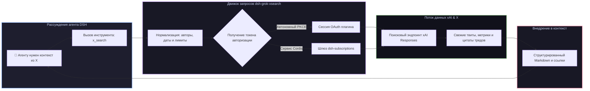

# 📦 @goodandready/dsh-grok-xsearch

<div align="center">

<h3>Инструмент поиска в X (Twitter) в реальном времени через SuperGrok OAuth для DeepSeek Harness</h3>

<p align="center">
  <a href="https://www.npmjs.com/package/@goodandready/dsh-grok-xsearch"></a>
  <a href="LICENSE"></a>
  <a href="https://github.com/topics/dsh-plugin"></a>
  <a href="https://nodejs.org"></a>
</p>

<p align="center">
  <a href="https://goodandready.app/"></a>
</p>

<p align="center">
  <a href="README.md"><b>🇬🇧 English</b></a> •
  <a href="README.ru.md"><b>🇷🇺 Русский</b></a> •
  <a href="README.zh.md"><b>🇨🇳 中文说明</b></a>
</p>

</div>

---

## ⚡ Обзор

**`dsh-grok-xsearch`** даёт агентам **DeepSeek Harness** возможность искать актуальную информацию в X (Twitter) в реальном времени через инструмент `x_search`.

Используя авторизованную сессию SuperGrok OAuth, агенты могут находить свежие новости, обсуждения разработчиков, треды сообществ и посты конкретных авторов за указанный диапазон дат без дорогостоящих тарифов X API.



---

## 🔍 Справочник параметров инструмента `x_search`

Плагин регистрирует `x_search` в `ctx.tools`, позволяя агентам запрашивать актуальные данные:

### Параметры инструмента

| Параметр | Тип | Обязательный | Описание |
|---|---|---|---|
| `query` | `string` | **Да** | Поисковый запрос, ключевые слова, тема или хэштеги |
| `authors` | `string[]` | Нет | Поиск по конкретным авторам (до 10 аккаунтов `@handle`) |
| `exclude_authors` | `string[]` | Нет | Исключение конкретных аккаунтов из выдачи (до 10 авторов) |
| `from_date` | `string` | Нет | Начальная дата фильтра (`ГГГГ-ММ-ДД`) |
| `to_date` | `string` | Нет | Конечная дата фильтра (`ГГГГ-ММ-ДД`) |
| `max_results` | `number` | Нет | Максимальное количество постов (по умолчанию `10`) |

---

## 🔑 Варианты авторизации

1. **Автономная авторизация SuperGrok OAuth**: прямой вход по протоколу PKCE в меню **Настройки → X Search**.
2. **Интеграция с экосистемой**: если в [`dsh-subscriptions`](https://github.com/GooDAnDReaDY/dsh-subscriptions) уже подключен аккаунт Grok, плагин автоматически подхватит его без повторной авторизации.

---

## 📦 Быстрая установка

```bash
dsh plugin --profile web add @goodandready/dsh-grok-xsearch
```

---

## 🔌 Маршруты HTTP API

| Маршрут | Метод | Описание |
|---|---|---|
| `/dsh-grok-xsearch/config` | `GET, POST` | Просмотр и изменение параметров поиска и лимитов |
| `/dsh-grok-xsearch/oauth/start` | `POST` | Запуск OAuth PKCE авторизации SuperGrok |
| `/dsh-grok-xsearch/oauth/callback` | `GET` | Обработка OAuth redirect и сохранение токена |
| `/dsh-grok-xsearch/oauth/complete` | `POST` | Завершение авторизации |
| `/dsh-grok-xsearch/logout` | `POST` | Отключение и сброс сессионных токенов |

---

## 📄 Лицензия

MIT © [GooDAnDReaDY](https://github.com/GooDAnDReaDY)
