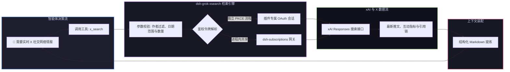

# 📦 @goodandready/dsh-grok-xsearch

<div align="center">

<h3>DeepSeek Harness X (Twitter) 实时搜索与 SuperGrok OAuth 插件</h3>

<p align="center">
  <a href="https://www.npmjs.com/package/@goodandready/dsh-grok-xsearch"></a>
  <a href="LICENSE"></a>
  <a href="https://github.com/topics/dsh-plugin"></a>
  <a href="https://nodejs.org"></a>
</p>

<p align="center">
  <a href="https://goodandready.app/"></a>
</p>

<p align="center">
  <a href="README.md"><b>🇬🇧 English</b></a> •
  <a href="README.ru.md"><b>🇷🇺 Русский</b></a> •
  <a href="README.zh.md"><b>🇨🇳 中文说明</b></a>
</p>

</div>

---

## ⚡ 插件概览

**`dsh-grok-xsearch`** 为 **DeepSeek Harness** 智能体提供 `x_search` 工具，使其能够实时检索 X (Twitter) 热门推文、突发事件、开发者讨论与特定作者时间线。



---

## 📦 安装指南

```bash
dsh plugin --profile web add @goodandready/dsh-grok-xsearch
```

---

## 📄 开源协议

MIT © [GooDAnDReaDY](https://github.com/GooDAnDReaDY)
